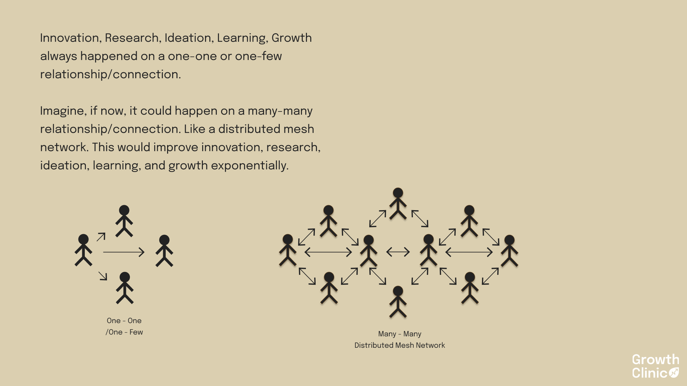

# Chapter 2: Community-Led Growth

At TKD Farms Farmers' Market in Ikoyi, Lagos, something fascinating happens every Saturday. Small business owners gather at Nakenoh's Boulevard, not just to sell their products, but to create something more valuable: a thriving community that transforms individual sellers into a vibrant market ecosystem.

Take S, the founder of Infused Organics, an organic hair and skincare brand. "We get direct feedback from customers and that leads to new products and collaborations," she explains. When a customer suggested creating a citrus-based infused oil, S didn't just note the idea — she acted on it, collaborating with another vendor who sells dried fruit snacks to source lemon zest. This collaboration led to a new best-selling product, demonstrating how community feedback directly drives innovation and growth.

## The Power of Many-to-Many Connections

Traditional business models often operate on a one-to-many basis: one seller to many buyers, one teacher to many students. But the most powerful community growth happens when we enable many-to-many connections.

Consider The BodyLanguage Company, a dance studio in Lagos. Instead of seeing their business as simply teaching dance classes, they recognised a bigger opportunity. They hold free dance classes almost every day of the week at different lounges and bars. As people join these events, enjoy themselves, and meet others, something remarkable happens — they naturally want to get better at dancing. Who do they turn to for lessons? The same instructors who introduced them to the joy of dance through these free events.

What makes this approach powerful is that it transforms a traditional service (dance lessons) into a community experience. The studio isn't just selling classes; they're creating spaces where people can experience the unique value of dance firsthand, connect with others who share their interests, progress naturally from casual participant to committed student, and become part of a larger community.

## Creating Shared Knowledge Networks

El Padrino, Lagos's go-to place for tacos, demonstrates how a business can build community through intentional knowledge sharing. While other restaurants might focus solely on food service, El Padrino has created a space where they connect personally with returning customers, making them feel like friends; organise diverse social events from parties to bingo sessions to bar crawls; partner strategically with complementary brands and locations; and maintain focus on their core community rather than trying to appeal to everyone.

The result? Even when they've changed locations multiple times, their loyal community follows them. They've become "the Maggi of Tacos" in Lagos — the undisputed leader in their space through community building.

## How Communities Create Markets

Jay's Diner in Lagos shows how focusing on a specific community need can create a thriving market. By operating exclusively from 6 PM to 5 AM, they've created a unique space for night owls and late-shift workers. Unlike 24-hour establishments that treat late nights as an afterthought, Jay's makes it their primary focus. This specialisation allows them to provide consistent quality service during night hours, build a loyal community of regular customers, create a space that feels like home for their niche audience, and maintain high standards when other establishments' service levels drop.

## The altMBA Case Study: Structured Community Learning

The altMBA provides a powerful example of how to structure community-led growth effectively. In an industry where online courses average a 4% completion rate, they achieve 96% completion through intentional community design. Using digital tools like Slack, Discourse, and Zoom, they engage students from 27 countries and 85 industries in intense four-week courses.

They switched from WordPress to Discourse specifically to enable more many-to-many interactions among students, recognising that peer learning and connection were crucial to their success.

As Marie Schacht, CEO of Akimbo (altMBA's parent company), explains: *"People add the learning time to their calendars and for them, it is time with other people, not just time to learn."* This insight reveals how the programme transforms what could be solitary study into social connection.

The impact of these connections extends far beyond the programme itself. "Members who completed courses 4 years ago still keep in touch and meet up with others they met in the week 1 groups," Marie notes. Their success comes from:

1. Small peer groups that create accountability
2. Real-world projects that drive engagement
3. Intensive feedback loops that accelerate learning
4. Time-boxed sessions that maintain momentum
5. Community bonds that turn learning into social connection

## Local Markets: Natural Economic Ecosystems

The TKD Farms market exemplifies how communities naturally evolve into economic ecosystems. Small business owners like S from Infused Organics report multiple benefits: direct customer feedback leading to product innovation, profitable partnerships and collaborations with other vendors, increased sales through word-of-mouth and customer loyalty, improved branding through community interaction, and sustained business growth through community support.

## Building Your Own Community-Led Growth

Whether you're building a physical community or a digital one, the principles remain the same:

**Enable Many-to-Many Connections** — Create spaces for organic interaction, encourage knowledge sharing, support member-led initiatives, and foster natural collaborations.

**Develop Knowledge Networks** — Listen to community feedback, act on community suggestions, encourage collaboration, and share successes openly.

**Support Market Evolution** — Focus on a specific community need, maintain consistent quality, build trust through personal connections, and balance growth with community values.

**Learn from Local Examples** — Study successful community markets, adapt proven practices, respect cultural contexts, and build on existing relationships.

## The Future of Community-Led Growth

As we look forward, community-led growth becomes increasingly important in a world where traditional business models are being disrupted, personal connections matter more than ever, innovation comes from unexpected collaborations, and local and global networks intersect.

The communities that thrive will be those that embrace many-to-many connections, build strong knowledge networks, support natural market evolution, and maintain community values while growing.

In the next chapter, we'll explore how to structure and scale these community systems while preserving their essential characteristics.
