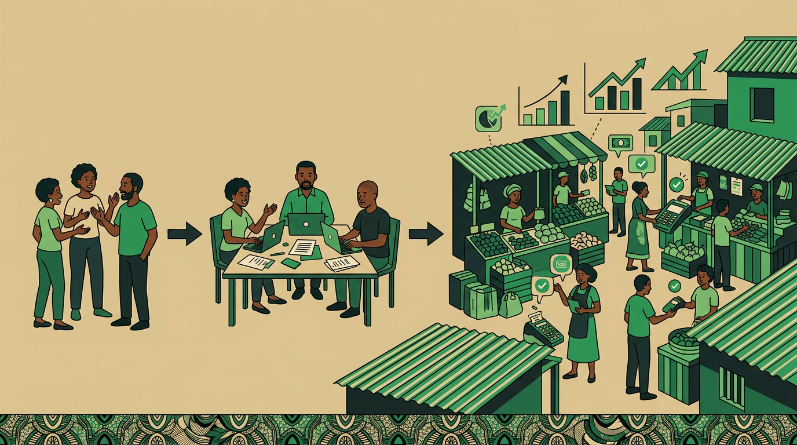

# Chapter 5: From GIS to GIOS

## Why GIS Needs to Evolve

The Growth and Innovation System (GIS) has successfully created a structured way to capture knowledge, facilitate learning, and enable community growth. However, as communities using the system grow, several needs are becoming clear:

1. The need to scale beyond human-to-human knowledge transfer
2. The ability to analyse journal entries to identify patterns and extract new mental models
3. The capability to customise learning paths based on user progress and community needs
4. The capacity to generate new micro-content adaptively
5. The ability to facilitate connections between community members with complementary skills and needs

These needs point to an evolution: from a system focused on human-to-human knowledge transfer to an operating system that could harness both human and artificial intelligence.

## Introducing the Growth and Innovation Operating System

GIOS is being developed to expand beyond GIS by incorporating AI to:

- Analyse journal entries to identify patterns and extract new mental models
- Customise learning paths based on user progress and community needs
- Generate new micro-content adaptively
- Facilitate connections between community members with complementary skills and needs

This evolution aims to maintain the core strengths of GIS while adding layers of intelligence that would make the system more adaptive and scalable. The key components being developed include:

**Specialised Language Models (SLMs)** — Models trained on specific domains like journal entries, with an understanding of mental models documentation and community interactions in local context.

**LLM Agent Network** — A Learning Path Agent for customising educational journeys, a Community Connection Agent for facilitating member interactions, an Innovation Agent for identifying patterns and opportunities, and a Feedback Agent for providing personalised guidance.

**Enhanced Mental Models** — Continuously refined through community interaction, adaptable based on local context and needs, and evolved through pattern recognition.

## The Potential Symbiosis of Human and Artificial Intelligence

The potential power of GIOS lies in how it could combine human and artificial intelligence:

**Human Intelligence Provides:**
- Real-world experience and context
- Cultural understanding and nuance
- Creative problem-solving
- Emotional intelligence and empathy

**Artificial Intelligence Could Add:**
- Pattern recognition at scale
- Data-driven insights
- Personalisation capabilities
- Connection facilitation

**Together They Could Enable:**
- Faster learning and adaptation
- More effective knowledge transfer
- Better resource allocation
- Stronger community connections

## Designing Feedback Loops for Continuous Evolution

GIOS is being designed with several key feedback loops in mind:

**Learning Loop** — Users provide responses and journal entries. The system analyses patterns and outcomes. Learning paths adapt based on effectiveness. New content can be generated to fill gaps.

**Community Loop** — Members interact and collaborate. The system identifies successful patterns. These patterns inform community organisation. New connections are facilitated based on outcomes.

**Innovation Loop** — Problems and solutions are documented. Patterns in successful solutions are identified. New approaches are suggested based on patterns. Outcomes feed back into the system.

**Evolution Loop** — System performance is continuously monitored. Successful patterns are reinforced. Ineffective approaches are modified. New capabilities are developed based on needs.

The key to these feedback loops is that they operate continuously and simultaneously, creating a system that evolves alongside its community.

## Looking Forward

As GIOS continues to develop, several possibilities are emerging:

- More sophisticated pattern recognition in community learning
- Better prediction of successful learning paths
- More effective facilitation of community connections
- Faster innovation cycles through better pattern recognition

The evolution from GIS to GIOS represents not just a potential technological advancement, but a fundamental shift in how we think about community learning and growth. By exploring ways to combine human wisdom with artificial intelligence, we're working to create a system that can scale while maintaining the personal, community-driven nature that made GIS effective.
